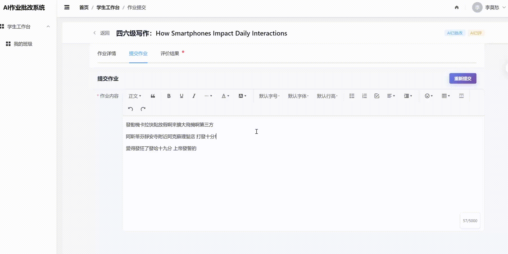
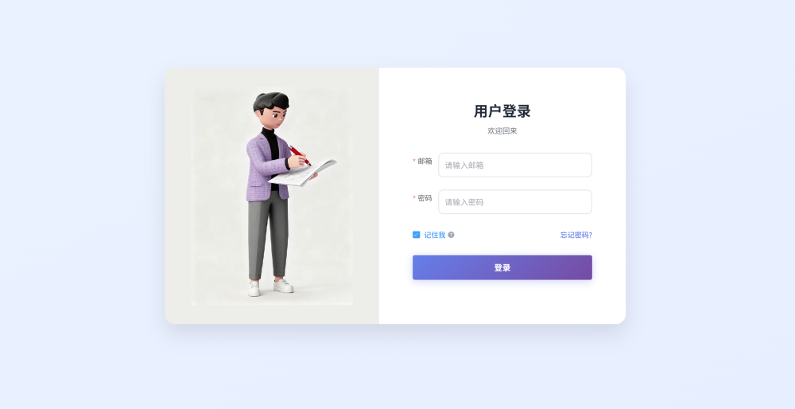
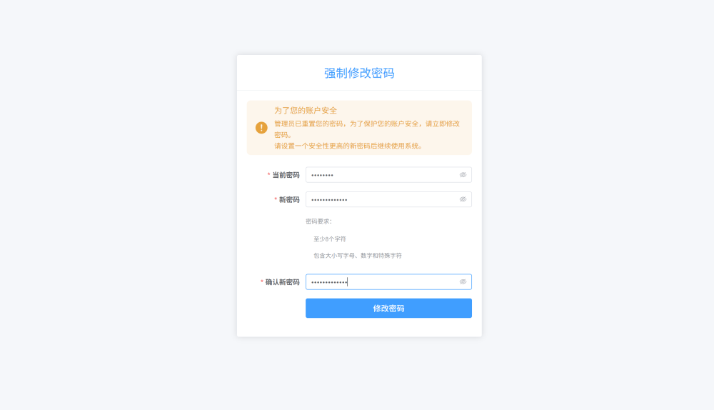
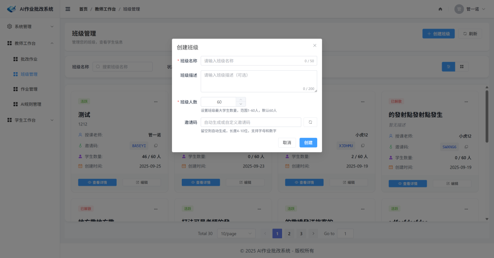
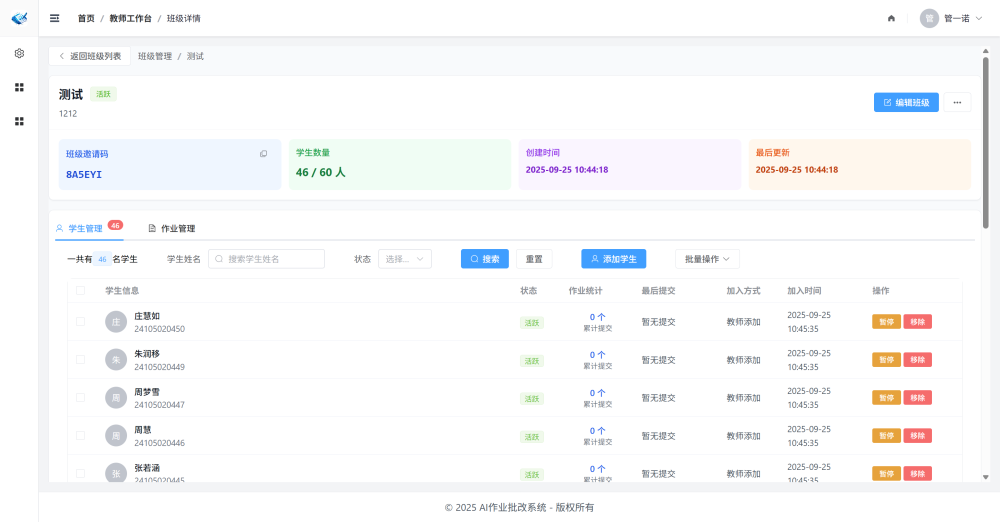
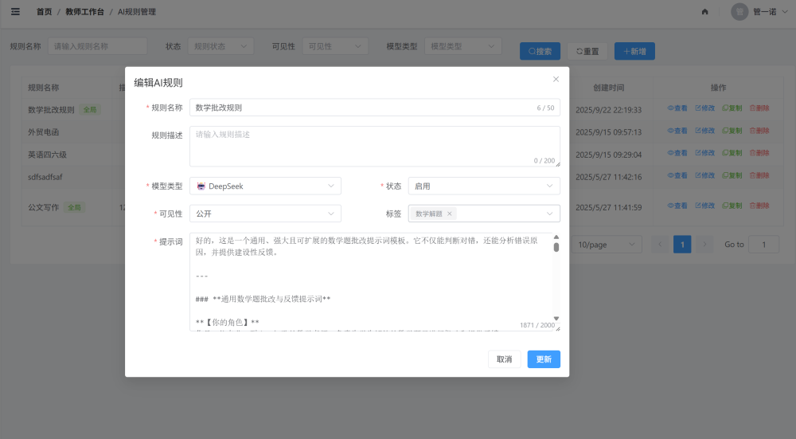
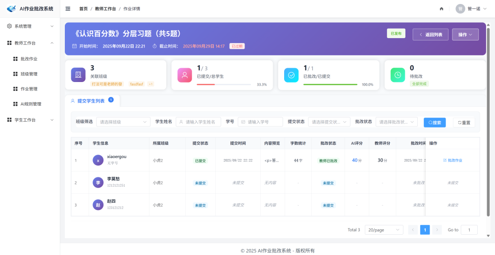
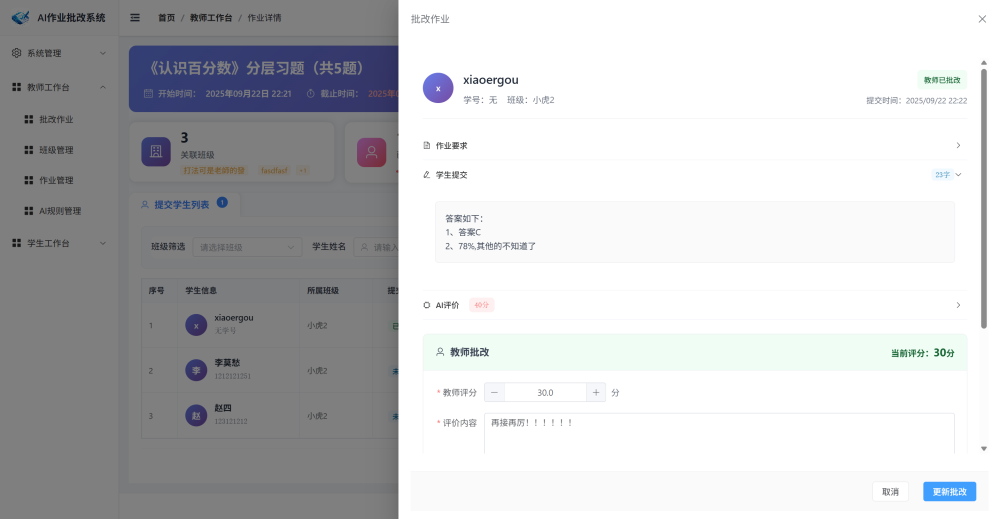
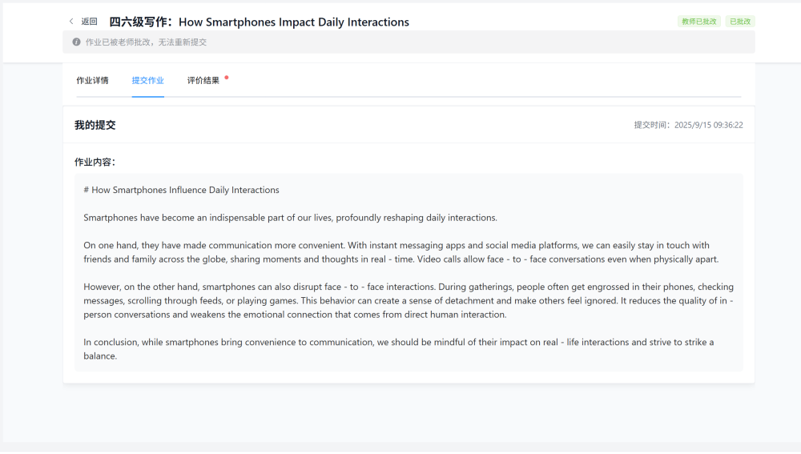
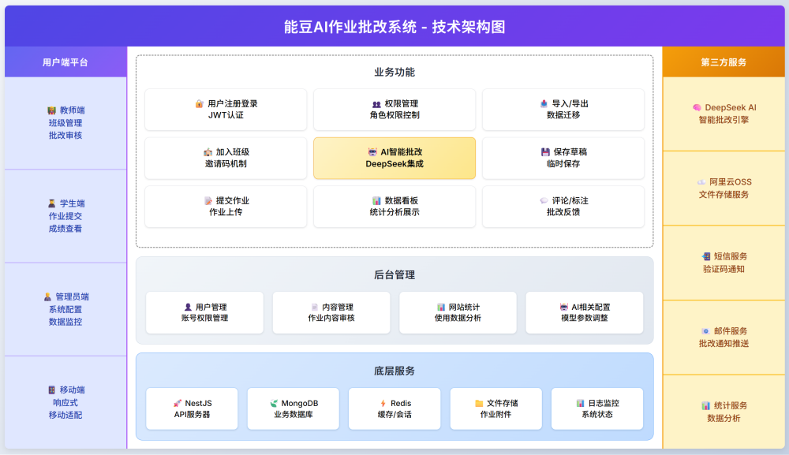

# 灵犀AI作业批改系统 

## 📚 项目背景

大家好，我是管一诺。前段时间有个朋友找我聊聊 AI+教学的事儿

她是英语老师，带了 4 个班，有 200 多个学生，经常熬夜批改作文。平时在用 DeepSeek 批改作业，可没办法批量修改，很特别麻烦。就希望能有个可以统一管理作业，沉淀教学数据的工具。

于是就有了"灵犀AI"这个产品，如下


集成DeepSeek分析能力，实现了**学生在线提交作业 → AI实时批改 → 教师人工核实批改**的完整业务闭环。




## 💻 在线预览


**演示地址**: http://ai.dslcv.com


## 🏗️ 技术栈


基于 **NestJS + Vue.js + MongoDB** 的全栈 AI 作业批改系统，

### 前端（已开源）

- **框架**: Vue 3 + TypeScript
- **状态管理**: Vuex
- **UI组件**: Element Plus
- **样式**: Tailwind CSS
- **构建工具**: Vite
- **富文本编辑**: WangEditor
- **HTTP客户端**: Axios

### 后端（整理发布中）
- **框架**: NestJS + TypeScript
- **数据库**: MongoDB + Mongoose
- **认证**: JWT + Redis（Token黑名单）
- **API文档**: Swagger
- **AI集成**: 支持多种大模型接入

## 🚀 快速开始

### 环境要求
- Node.js >= 16.0
- MongoDB >= 4.4
- Redis >= 6.0
- npm 或 pnpm

### 本地开发

#### 1. 克隆项目
```bash
git clone https://gitee.com/wang-tians-laboratory/nengdou-ai-review-helper-web
cd nengdou-ai-review-helper-web
```

#### 2. 安装依赖
```bash
npm install
# 或
pnpm install
```
#### 3. 启动开发服务器
```bash
npm run dev
# 或
pnpm dev
```

访问 `http://localhost:5173` 即可查看项目。


## ✨ 功能展示

### 🔐 统一认证系统



- 统一登录入口，支持多角色登录
- JWT令牌认证 + Redis黑名单机制
- 首次登录强制修改密码
- 密码加密存储，安全可靠



### 👨‍💼 管理员功能

#### 数据看板


- 实时统计用户数量、作业数量、提交情况
- 多维度数据图表展示
- 系统运行状态监控

#### 系统配置


- ✅ **用户管理**: 批量导入、编辑、删除用户
- ✅ **角色管理**: 权限分配、角色配置
- ✅ **菜单管理**: 动态菜单配置
- ✅ **大模型配置**: 支持多种AI模型接入（OpenAI、通义千问等）
- ✅ **系统日志**: 操作日志记录与审计

### 👨‍🏫 教师功能

#### 教学中心


教师端功能概览，包含班级管理、作业管理、批改管理等核心模块。

#### 1. 班级管理

**创建班级**


- ✅ 自定义班级名称、描述和邀请码
- ✅ 卡片式展示，支持搜索、筛选和排序
- ✅ 班级详情与实时数据统计

**学生管理**


- ✅ 批量导入学生（Excel/CSV）
- ✅ 学生通过邀请码自主加入
- ✅ 学生状态管理（激活/暂停/移除）
- ✅ 学生作业完成情况统计

#### 2. 作业管理

**发布作业**


- ✅ 富文本编辑器支持多种格式
- ✅ 设置作业截止时间
- ✅ 关联AI批改规则
- ✅ 选择发布班级

**配置AI批改规则**


- ✅ 自定义评分标准
- ✅ 多维度评价维度
- ✅ AI提示词模板管理
- ✅ 规则复用与版本管理

#### 3. 作业批改

**查看作业详情**


- ✅ 学生提交列表
- ✅ AI批改进度实时更新
- ✅ 批改状态筛选

**人工审核打分**


- ✅ 查看AI批改结果
- ✅ 人工复核与调整分数
- ✅ 详细评语反馈
- ✅ 批改记录追溯

### 👨‍🎓 学生功能

#### 学习中心


学生端主界面，展示所有班级和待完成作业。

#### 班级与作业


- ✅ 查看加入的班级列表
- ✅ 查看班级内作业
- ✅ 作业状态标识（待提交/已提交/已批改）

#### 提交作业


- ✅ 富文本编辑器答题
- ✅ 支持图片、附件上传
- ✅ 草稿保存功能
- ✅ 提交前预览

#### 查看结果


- ✅ AI批改结果实时查看
- ✅ 详细评分维度展示
- ✅ 教师评语查看
- ✅ 历史提交记录


## 📂 项目结构

```
nengdou-ai-review-helper/
├── public/                      # 静态资源
│   ├── favicon.ico
│   └── README/                  # 功能截图
│
├── src/
│   ├── api/                     # API 服务层
│   │   ├── ai-models.ts         # AI模型管理API
│   │   ├── ai-rule.ts           # AI批改规则API
│   │   ├── assignments.ts       # 作业管理API
│   │   ├── auth.ts              # 认证API
│   │   ├── classes.ts           # 班级管理API
│   │   ├── correcting.ts        # 批改管理API
│   │   ├── dashboard.ts         # 数据看板API
│   │   ├── logs.ts              # 日志API
│   │   ├── menu.ts              # 菜单管理API
│   │   ├── role.ts              # 角色管理API
│   │   ├── submissions.ts       # 作业提交API
│   │   ├── template.ts          # 模板API
│   │   ├── user-role.ts         # 用户角色关联API
│   │   └── user.ts              # 用户管理API
│   │
│   ├── assets/                  # 静态资源
│   │   ├── image/               # 图片资源
│   │   ├── video/               # 视频资源
│   │   └── styles/              # 全局样式
│   │
│   ├── components/              # 公共组件
│   │   ├── AdaptiveTableContainer.vue  # 自适应表格容器
│   │   ├── JoinClassDialog.vue         # 加入班级对话框
│   │   ├── PageHeader.vue              # 页面头部组件
│   │   ├── SearchCard.vue              # 搜索卡片组件
│   │   └── WangEditor.vue              # 富文本编辑器
│   │
│   ├── config/                  # 配置文件
│   │   └── ai-config.ts         # AI相关配置
│   │
│   ├── hooks/                   # 自定义Hooks
│   │   └── useAdaptiveTable.ts  # 自适应表格Hook
│   │
│   ├── layouts/                 # 布局组件
│   │   ├── components/
│   │   │   ├── AppHeader.vue             # 应用头部
│   │   │   ├── AppSidebar.vue            # 侧边栏
│   │   │   ├── AppTopNavbar.vue          # 顶部导航栏
│   │   │   ├── Breadcrumb.vue            # 面包屑导航
│   │   │   ├── ChangePasswordDialog.vue  # 修改密码对话框
│   │   │   └── menu/                     # 菜单组件
│   │   ├── AppLayout.vue        # 主布局
│   │   └── TopNavLayout.vue     # 顶部导航布局
│   │
│   ├── router/                  # 路由配置
│   │   ├── index.ts             # 路由定义
│   │   └── permission.ts        # 权限控制
│   │
│   ├── store/                   # Vuex 状态管理
│   │   ├── modules/
│   │   │   ├── app.ts           # 应用状态
│   │   │   ├── auth.ts          # 认证状态
│   │   │   ├── dashboard.ts     # 看板状态
│   │   │   └── user.ts          # 用户状态
│   │   └── index.ts
│   │
│   ├── types/                   # TypeScript 类型定义
│   │   ├── assignments.ts       # 作业类型
│   │   ├── auth.ts              # 认证类型
│   │   ├── classes.ts           # 班级类型
│   │   ├── common.ts            # 通用类型
│   │   ├── logs.ts              # 日志类型
│   │   ├── menu.ts              # 菜单类型
│   │   ├── role.ts              # 角色类型
│   │   └── user.ts              # 用户类型
│   │
│   ├── utils/                   # 工具函数
│   │   ├── auth-codes.ts        # 认证码工具
│   │   ├── date.ts              # 日期处理
│   │   ├── format.ts            # 格式化工具
│   │   └── request.ts           # HTTP请求封装
│   │
│   ├── views/                   # 页面视图
│   │   ├── admin/               # 管理员页面
│   │   │   └── dashboard/       # 管理员看板
│   │   │
│   │   ├── dashboard/           # 各角色看板
│   │   │   ├── AdminDashboard.vue
│   │   │   ├── TeacherDashboard.vue
│   │   │   ├── StudentDashboard.vue
│   │   │   └── components/      # 看板组件
│   │   │       ├── charts/      # 图表组件
│   │   │       └── StatCard.vue # 统计卡片
│   │   │
│   │   ├── system/              # 系统管理页面
│   │   │   ├── ai_model/        # AI模型管理
│   │   │   ├── classes/         # 班级管理
│   │   │   ├── logs/            # 日志管理
│   │   │   ├── menus/           # 菜单管理
│   │   │   ├── roles/           # 角色管理
│   │   │   └── users/           # 用户管理
│   │   │
│   │   ├── teacher/             # 教师端页面
│   │   │   ├── ai-rules/        # AI批改规则
│   │   │   │   ├── components/
│   │   │   │   └── index.vue
│   │   │   ├── assignments/     # 作业管理
│   │   │   │   ├── components/
│   │   │   │   ├── detail/      # 作业详情
│   │   │   │   └── index.vue
│   │   │   ├── classes/         # 班级管理
│   │   │   │   ├── components/
│   │   │   │   ├── detail/      # 班级详情
│   │   │   │   └── index.vue
│   │   │   └── correcting/      # 批改管理
│   │   │
│   │   ├── student/             # 学生端页面
│   │   │   ├── assignments/     # 作业列表
│   │   │   ├── classes/         # 班级列表
│   │   │   │   ├── components/
│   │   │   │   └── composables/ # 组合式API
│   │   │   └── submissions/     # 作业提交
│   │   │       ├── components/
│   │   │       └── composables/
│   │   │
│   │   ├── Home.vue             # 首页
│   │   ├── Login.vue            # 登录页
│   │   └── ForceChangePassword.vue  # 强制修改密码页
│   │
│   ├── docs/                    # 项目文档
│   │   ├── ADAPTIVE_TABLE_GUIDE.md          # 表格组件指南
│   │   ├── PAGE_HEADER_STANDARDIZATION.md   # 页面头部规范
│   │   ├── token-blacklist-redis.md         # Token黑名单说明
│   │   └── ...
│   │
│   ├── App.vue                  # 根组件
│   └── main.ts                  # 应用入口
│
├── auto-imports.d.ts            # 自动导入类型声明
├── components.d.ts              # 组件类型声明
├── Dockerfile                   # Docker配置
├── nginx.conf                   # Nginx配置
├── package.json                 # 项目依赖
├── tsconfig.json                # TypeScript配置
├── vite.config.ts               # Vite配置
└── README.MD                    # 项目说明
```


## 🎯 核心技术亮点

### 1. AI智能批改

- 支持多种大模型接入（OpenAI、通义千问、文心一言等）
- 自定义批改规则和评分维度
- 异步批改队列，提高系统并发能力
- 批改结果实时推送

### 2. 权限管理
- 基于RBAC的权限控制
- 动态菜单生成
- 细粒度的功能权限控制
- JWT + Redis Token黑名单机制

### 3. 自适应设计
- 响应式布局，适配多种屏幕尺寸
- 自适应表格组件
- 移动端友好的交互体验

### 4. 性能优化
- 路由懒加载
- 组件按需加载
- 图片懒加载
- API请求缓存

## 📊 系统架构




## 👥 联系方式

### 邮箱📮
1970652600@qq.com
### 微信
微信号：nuoyi3111 （请备注来源）


## 🌟 Star History

如果这个项目对你有帮助，欢迎给个 Star ⭐️

 